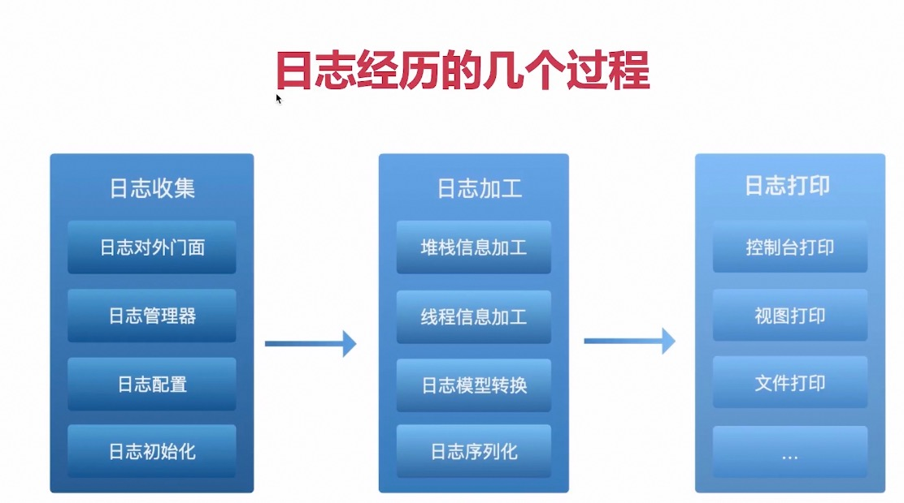
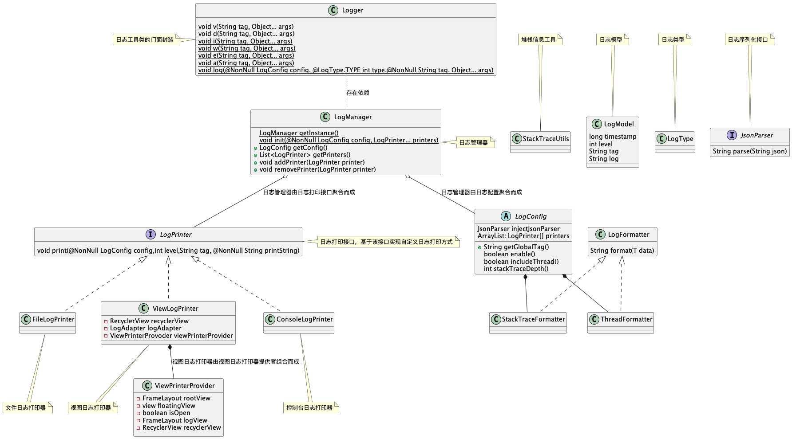

# 需求分析
* 能够打印堆栈信息
* 支持任何数据类型的打印
* 支持实时日志可视化
* 能够实现文件打印模块
* 支持不同打印器的插拔

# 设计分析

# 技术点分析

| 日志收集 |  日志加工  | 日志打印   |
|:-------|:---|:---|
| 面向接口编程 | 堆栈信息相关技术 | 文件IO技术 |
| 设计模式  | 序列化 | 多线程技术（线程复用、线程同步）|
| 解耦设计  | 日志格式化 | UI以及列表相关技术 |

# 疑难点分析
* 堆栈信息获取
* 打印器的插拔设计
* 线程复用防止频繁创建线程
* 线程同步

# 架构设计

